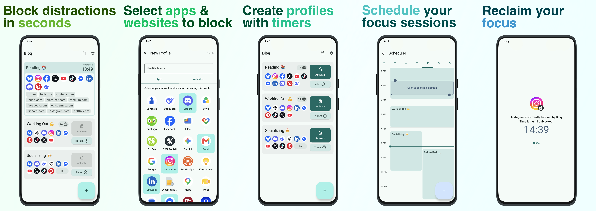

# Bloq

Bloq is a sophisticated Android productivity application designed to help users reclaim their focus by intelligently blocking distracting apps and websites while managing intrusive notifications. 

## Screenshots

  

## Key Features

-   **Real-time App Blocking**: Utilizes a custom `AccessibilityService` to monitor window state changes and intercept the launch of blacklisted applications instantly.
-   **Advanced Website Interception**: Inspects the UI hierarchy of popular browsers (Chrome, Firefox, etc.) to detect and block access to specific distracting URLs.
-   **Automated Focus Scheduling**: Leverages `AlarmManager` for high-precision, battery-efficient triggering of blocking sessions, with `WorkManager` ensuring reliable background state synchronization across system reboots and time changes.
-   **Notification Silence**: Employs `NotificationListenerService` to suppress notifications from blocked apps, preventing "notification pull" during focus sessions.
-   **Granular Profiles**: Create and schedule different blocking configurations for work, sleep, or study.

## Architecture & Technical Highlights

Bloq is engineered for scalability and testability using a **Modular Clean Architecture**:

-   **Multi-module Structure**: 
    -   `:app`: Dependency injection root, system service implementations, and navigation;
    -   `:core`: Common utilities and design components;
    -   `:profiles`: Domain and Data layers for managing user-defined blocking configurations;
    -   `:timer`: Timer logic;
    -   `:scheduler`: Scheduling logic and UI;
    -   `:permissions`: Handling permissions;
    -   `:settings`: Application preferences and user data management.

## Tech Stack

-   **Language**: Kotlin
-   **UI**: Jetpack Compose
-   **Architecture**: MVVM / MVI
-   **DI**: Koin
-   **Database**: Room
-   **Persistence**: DataStore
-   **Concurrency**: Coroutines & Flow
-   **Build System**: Gradle Kotlin DSL + Version Catalogs

---

*Bloq is a demonstration of high-quality Android engineering, focusing on solving complex system-level problems with clean, maintainable code.*
